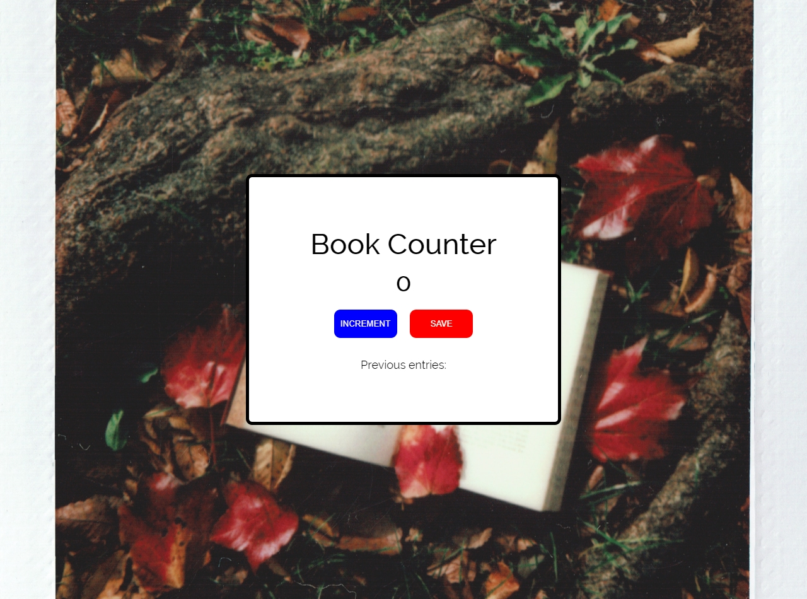

# Scrimba - Build a passenger counter app

This is an alternaitve solution to the [Build a passenger counter app](https://scrimba.com/learn/frontend) section of Module 3 to The Frontend Developer Career Path from [Scrimba](https://scrimba.com). 

## Table of contents

- [Scrimba - Build a passenger counter app](#scrimba---build-a-passenger-counter-app)
  - [Table of contents](#table-of-contents)
  - [Overview](#overview)
    - [The challenge](#the-challenge)
    - [Screenshot](#screenshot)
    - [Links](#links)
  - [My process](#my-process)
    - [Built with](#built-with)
  - [Author](#author)

## Overview

### The challenge

Put a spin on the original solution for the passenger counter app and make it your own.

### Screenshot

### Links

- Solution URL: [Github Repo](https://github.com/varonalearns/Book-Counter)
- Live Site URL: [Netlify Live Site](https://idyllic-clafoutis-7f00ed.netlify.app)

## My process

### Built with

- Semantic HTML5 markup
- CSS custom properties
- Flexbox
- Vanilla JavaScript

## Author

- Website - [Evalia Varona](https://www.evaliavarona.com)
- Hashnode - [@evavarona](https://evaliavarona.hashnode.dev)

